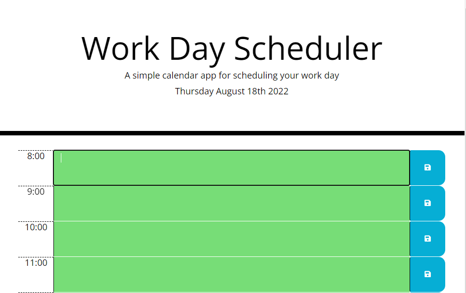
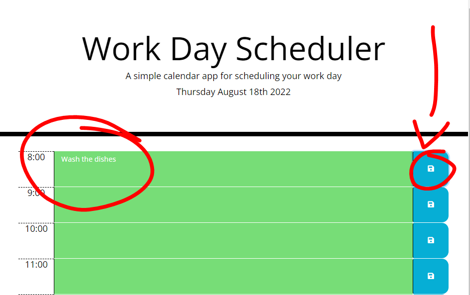

# Work-Day-Scheduler
This calendar app for scheduling your work day was designed to enhance my skills using 3rd party API's. This project used BootStrap and jQuery as well as moment.js to create a Work Day Scheduler.

## Built With
* HTML
* CSS
* BootStrap
* jQuery
* Moment.js

<<<<<<< HEAD
## Site Location
[Work Day Scheduler](https://daniel-lago.github.io/work-day-scheduler-hw/)

## Contribution
Made by [Daniel-lago]

## Site Image

 This will be the main page for the scheduler, the user will be able to see the work-hours of the day, and also see today's date. 
 The user will know when the hour has passed once that the bar changes its color, depending if the color is red, gray or orange the user will know the indicator.

When the user add a homework or a commitment just need to click on save button to keep that information on the page, no matter if they close the tab or the browser. 

### ©️2022 Daniel Lago
